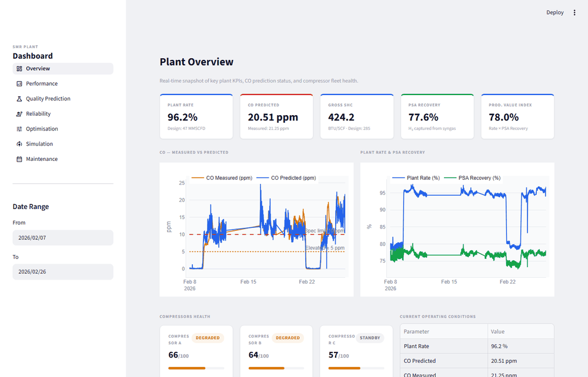
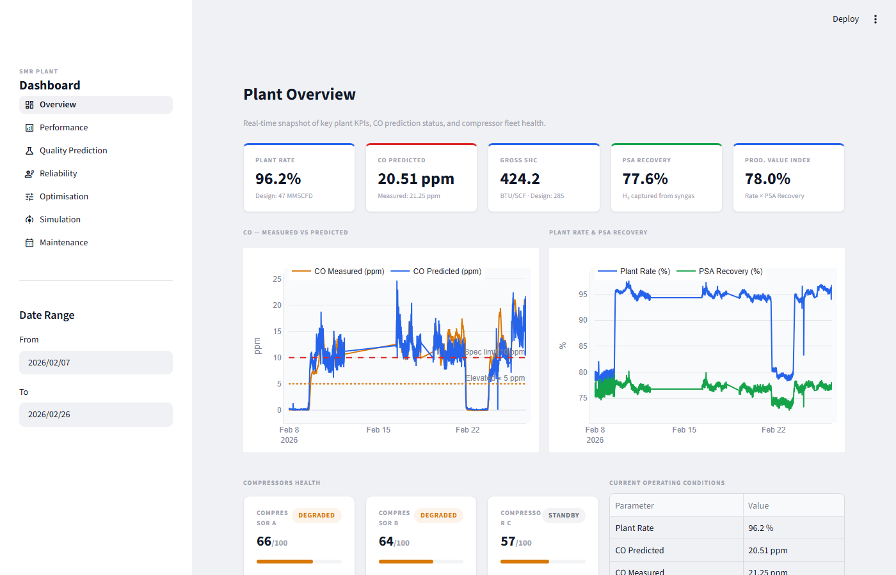
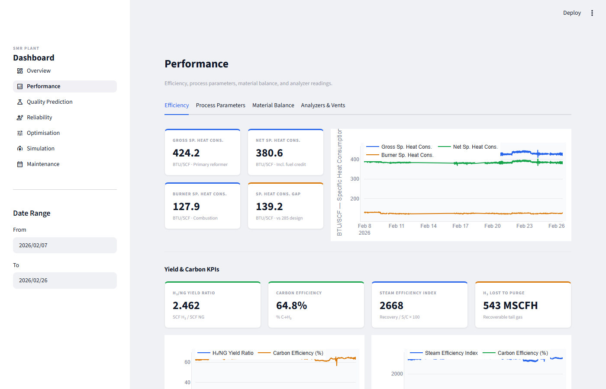
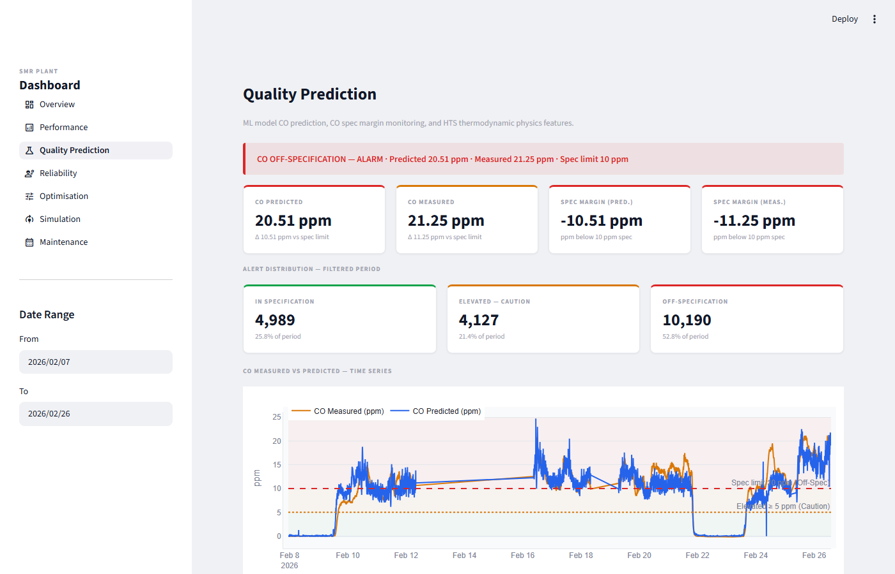
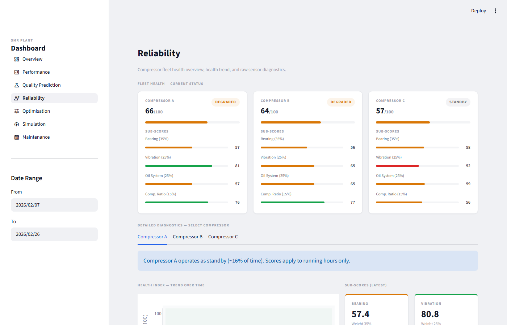
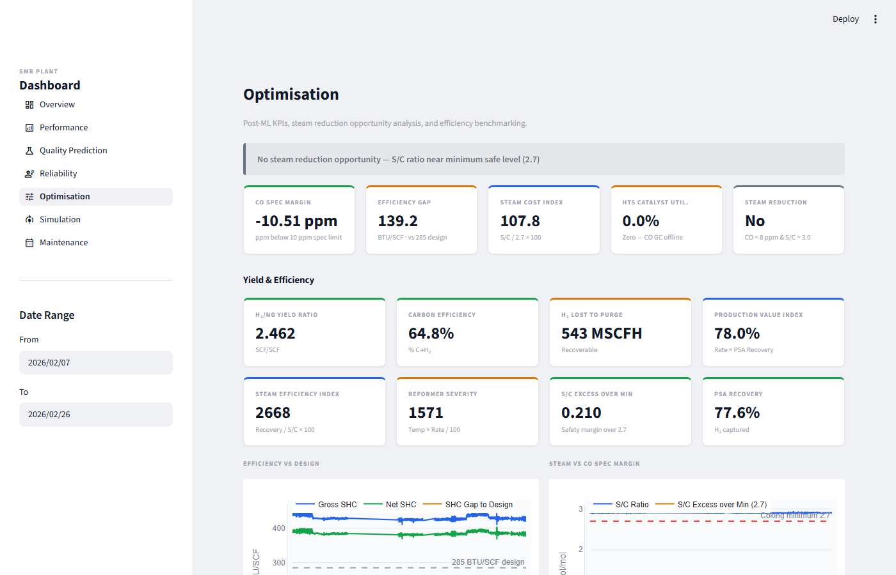
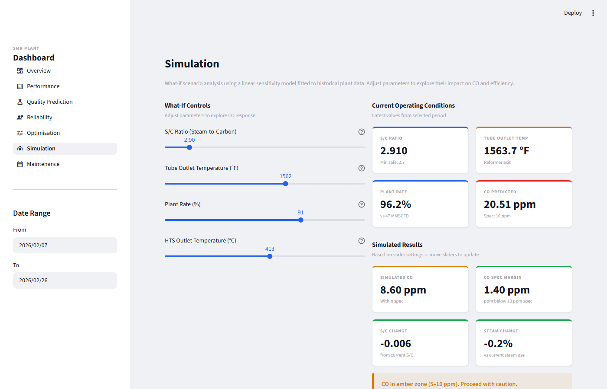
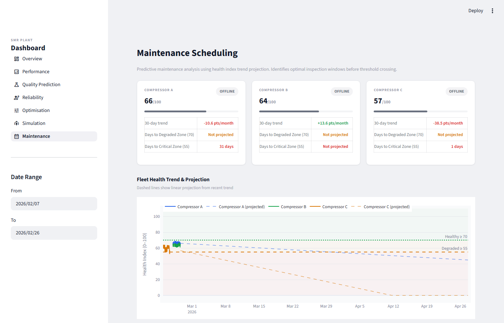

# Hydrogen Production Plant — ML Intelligence Dashboard

[](https://hydrogen-appuction-plant-xhhtdm2szsjcdw2vgm3zmv.streamlit.app/)
[](https://python.org)
[](https://xgboost.readthedocs.io)
[](https://plotly.com)
[](https://shap.readthedocs.io)

**Live app: https://hydrogen-appuction-plant-xhhtdm2szsjcdw2vgm3zmv.streamlit.app/**

> **End-to-end machine learning platform for a Steam Methane Reformer (SMR) hydrogen plant.**
> Covers CO quality prediction, compressor health monitoring, process optimisation, and predictive maintenance — all surfaced through a real-time Streamlit dashboard.

---



---

## Overview

This project was built for an industrial hydrogen production facility operating a Steam Methane Reformer (SMR). The plant produces hydrogen via catalytic steam reforming of natural gas, with purity controlled to a 10 ppm CO-in-product specification.

The platform ingests historian data, computes ~50 process KPIs, trains an ensemble ML model for CO prediction, scores compressor fleet health, and presents everything through an interactive, multi-page Streamlit dashboard designed for plant operators and engineers.

---

## Key Features

| Module | Description |
|---|---|
| **CO Quality Prediction** | Ensemble ML model (Ridge + Random Forest + XGBoost) predicts CO-in-product ppm in real time. Colour-coded alert status (In Spec / Elevated Caution / Off-Specification). |
| **Compressor Health Index** | Composite health scoring across Bearing, Vibration, Oil System, and Compression Ratio sub-scores. Weighted index with trend tracking. |
| **Process KPI Engine** | ~50 KPIs computed from raw flow/temperature/pressure historian tags — material balances, efficiency metrics, steam-to-carbon ratio, PSA performance, and more. |
| **Predictive Maintenance** | Linear trend projection of compressor health index forward 60 days. Priority matrix (Urgency vs Criticality), Gantt timeline, recommended action cards. |
| **What-If Simulator** | Ridge regression sensitivity model. Operators adjust S/C ratio, tube temperature, plant rate, and HTS outlet temperature on sliders to see simulated CO response before making changes. |
| **Process Optimisation** | Steam reduction opportunity flag, efficiency gap to design, yield and carbon efficiency tracking, CO spec margin trending. |
| **Material Balance Heatmap** | 7 material balance deviation streams visualised as a time × stream heatmap with green→amber→red colorscale. |

---

## Dashboard Pages

| Page | Screenshot |
|---|---|
| **Overview** — KPIs, CO trend, compressor summary, operating conditions |  |
| **Performance** — Specific Heat Consumption, material balance heatmap, analyzers |  |
| **Quality Prediction** — ML CO prediction, spec margin tiles, alert distribution |  |
| **Reliability** — Fleet health cards, health index trend, sub-score tiles |  |
| **Optimisation** — Steam reduction, yield KPIs, efficiency vs design |  |
| **Simulation** — What-if slider controls → current vs simulated results |  |
| **Maintenance** — Predictive scheduling, health projection, priority matrix |  |

---

## Tech Stack

| Layer | Technology |
|---|---|
| **Dashboard** | Streamlit, Plotly |
| **ML Models** | scikit-learn (Ridge, Random Forest, IsolationForest), XGBoost |
| **Feature Engineering** | Pandas, NumPy — HTS thermodynamics, PSA space velocity proxy, WGS equilibrium |
| **Model Explainability** | SHAP |
| **Data Pipeline** | Custom Python pipeline: ingestion → KPI computation → feature engineering → model scoring |
| **Health Scoring** | Weighted composite index with IQR-normalised sub-scores |

---

## Architecture

```
Historian CSV
     │
     ▼
Data_Ingestion.py          — Raw tag ingestion, type normalisation, timestamp alignment
     │
     ▼
kpi_formulas.py            — ~50 KPI computations (material balances, efficiency, S/C ratio…)
     │
     ▼
feature_engineering.py     — HTS thermodynamics, WGS equilibrium CO%, PSA space velocity
     │
     ▼
co_product_model.py        — Ensemble CO predictor (Ridge + RF + XGBoost voting)
compressor_reliability.py  — Health index scoring for compressor fleet
     │
     ▼
Combined_Data_with_KPIs.csv  — Enriched output (gitignored — not included in repo)
     │
     ▼
dashboard/                 — Streamlit multi-page app
    app.py                 — Overview page
    pages/
        2_Performance.py
        3_Quality_Prediction.py
        4_Reliability.py
        5_Optimisation.py
        6_Simulation.py
        7_Maintenance_Scheduling.py
    utils/
        data_loader.py     — Data loading, caching, KPI helper functions
        charts.py          — Plotly chart factory (timeseries, gauges, health indicators)
        components.py      — CSS injection, KPI tile components, nav sidebar
```

---

## Installation

```bash
# 1. Clone the repository
git clone https://github.com/usamazubair4/Hydrogen-Production-Plant.git
cd Hydrogen-Production-Plant

# 2. Create and activate a virtual environment
python -m venv venv
# Windows:
venv\Scripts\activate
# macOS/Linux:
source venv/bin/activate

# 3. Install dependencies
pip install -r requirements.txt

# 4. Run the dashboard
cd dashboard
streamlit run app.py
```

> **The app runs immediately after cloning.** A synthetic 30-day sample dataset is included in `sample_data/` — no data file setup required. To use real historian data, place `Combined_Data_with_KPIs.csv` in the project root and the dashboard will use it automatically.

---

## Data Pipeline (Optional — generate KPIs from raw historian data)

If you have a raw historian export (`Combined_Data.csv`), run the full pipeline:

```bash
python main.py
```

This runs:
1. Data ingestion and tag normalisation
2. KPI formula computation (~50 metrics)
3. HTS thermodynamic feature engineering
4. CO-in-product ensemble model training and scoring
5. Compressor health index computation
6. Output: `Combined_Data_with_KPIs.csv`

> **Note:** Raw historian data (`*.csv`) is excluded from this repository via `.gitignore` to protect operational data.

---

## CO Prediction Model

The CO-in-product prediction uses a voting ensemble of three models:

| Model | Weight | Role |
|---|---|---|
| Ridge Regression | 1 | Baseline linear relationship |
| Random Forest | 1 | Non-linear feature interactions |
| XGBoost | 1 | Gradient-boosted residual correction |

**Key features:** S/C ratio, tube outlet temperature, plant rate, HTS outlet temperature, WGS equilibrium CO%, PSA space velocity proxy, shift reactor ΔT.

**Alert thresholds:** < 5 ppm (In Spec) · 5–10 ppm (Elevated Caution) · ≥ 10 ppm (Off-Specification)

---

## Compressor Health Index

```
Health Index = 0.35 × Bearing Score
             + 0.25 × Vibration Score
             + 0.25 × Oil System Score
             + 0.15 × Compression Ratio Score
```

Each sub-score is normalised (0–100) using IQR-based scaling relative to healthy historical baselines.

| Health Index | Status |
|---|---|
| ≥ 70 | Healthy |
| 55 – 69 | Degraded — inspection recommended |
| < 55 | Critical — immediate action required |

---

## Project Structure

```
├── dashboard/                  # Streamlit application
│   ├── app.py
│   ├── pages/
│   └── utils/
├── sample_data/                # Synthetic demo dataset (safe to commit)
│   └── Combined_Data_with_KPIs.csv
├── docs/screenshots/           # Dashboard screenshots for portfolio
├── co_product_model.py         # Ensemble CO predictor
├── compressor_reliability.py   # Fleet health scoring
├── feature_engineering.py      # Thermodynamic feature computation
├── kpi_formulas.py             # Process KPI definitions
├── Data_Ingestion.py           # Raw data ingestion
├── main.py                     # Full pipeline orchestrator
├── optimization.py             # Process optimisation logic
├── requirements.txt
├── .gitignore
└── README.md
```

---

## Skills Demonstrated

- **Machine Learning** — Ensemble regression, anomaly detection (Isolation Forest), SHAP explainability
- **Industrial Process Engineering** — SMR/hydrogen plant domain, thermodynamic modelling (WGS equilibrium), material balance computation
- **Data Engineering** — Multi-source historian ingestion, KPI formula pipeline, time-series processing
- **Dashboard Development** — Multi-page Streamlit, Plotly interactive charts, CSS custom components
- **Predictive Maintenance** — Health index trending, threshold projection, maintenance priority scoring

---

## Disclaimer

All plant process data has been excluded from this repository. Tag identifiers and site-specific names have been generalised. The code, models, and dashboard are shared for portfolio and reference purposes only.

---

*Built with Python · Streamlit · scikit-learn · XGBoost · Plotly*
